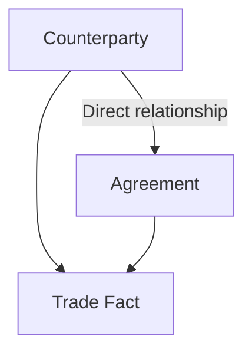

Yes—that is the MSTRT-506 point.

We need three tables with two possible paths between Counterparty and Agreement:



When a report requests only:

- Counterparty
    
- Agreement
    
- An agreement-level metric
    

Strategy should use the direct `Counterparty → Agreement` relationship. It should not unnecessarily resolve the relationship through `Trade Fact`.

## Controlled test data

The test must contain at least one agreement without any fact rows. That makes it immediately obvious which path Strategy selected.

### 1. Counterparty table

```sql
CREATE OR REPLACE TABLE main.mstrt506.dim_counterparty (
    counterparty_id   STRING NOT NULL,
    counterparty_name STRING NOT NULL,

    CONSTRAINT mstrt506_counterparty_pk
        PRIMARY KEY (counterparty_id)
)
USING DELTA;
```

```sql
INSERT INTO main.mstrt506.dim_counterparty
VALUES
    ('C001', 'Apex Bank'),
    ('C002', 'Beacon Bank');
```

### 2. Agreement table

This contains the direct relationship to Counterparty.

```sql
CREATE OR REPLACE TABLE main.mstrt506.dim_agreement (
    agreement_id   STRING NOT NULL,
    counterparty_id STRING NOT NULL,
    agreement_type STRING,

    CONSTRAINT mstrt506_agreement_pk
        PRIMARY KEY (agreement_id),

    CONSTRAINT mstrt506_agreement_counterparty_fk
        FOREIGN KEY (counterparty_id)
        REFERENCES main.mstrt506.dim_counterparty (counterparty_id)
)
USING DELTA;
```

```sql
INSERT INTO main.mstrt506.dim_agreement
VALUES
    ('AG001', 'C001', 'CSA'),
    ('AG002', 'C001', 'GMRA'),
    ('AG003', 'C001', 'ISDA'),  -- deliberately has no trade
    ('AG004', 'C002', 'CSA');
```

### 3. Trade fact table

This creates the alternative fact-mediated path.

```sql
CREATE OR REPLACE TABLE main.mstrt506.fact_trade (
    trade_id        STRING NOT NULL,
    counterparty_id STRING NOT NULL,
    agreement_id    STRING NOT NULL,
    trade_amount    DECIMAL(18,2),

    CONSTRAINT mstrt506_trade_pk
        PRIMARY KEY (trade_id),

    CONSTRAINT mstrt506_trade_counterparty_fk
        FOREIGN KEY (counterparty_id)
        REFERENCES main.mstrt506.dim_counterparty (counterparty_id),

    CONSTRAINT mstrt506_trade_agreement_fk
        FOREIGN KEY (agreement_id)
        REFERENCES main.mstrt506.dim_agreement (agreement_id)
)
USING DELTA;
```

```sql
INSERT INTO main.mstrt506.fact_trade
VALUES
    ('T001', 'C001', 'AG001', 100.00),
    ('T002', 'C001', 'AG001', 150.00),
    ('T003', 'C001', 'AG002', 200.00),
    ('T004', 'C002', 'AG004', 300.00);
```

Notice:

- `AG003` belongs to Apex Bank.
    
- `AG003` has no trade.
    
- `AG001` has two trades.
    

Those two conditions let us detect both missing and duplicated agreements.

## Correct query: direct relationship

```sql
SELECT
    c.counterparty_name,
    a.agreement_id,
    a.agreement_type
FROM main.mstrt506.dim_counterparty AS c
JOIN main.mstrt506.dim_agreement AS a
    ON c.counterparty_id = a.counterparty_id
ORDER BY
    c.counterparty_name,
    a.agreement_id;
```

Expected result:

|Counterparty|Agreement|Type|
|---|---|---|
|Apex Bank|AG001|CSA|
|Apex Bank|AG002|GMRA|
|Apex Bank|AG003|ISDA|
|Beacon Bank|AG004|CSA|

`AG003` is displayed even though it has no trades.

Agreement count using the direct path:

```sql
SELECT
    c.counterparty_name,
    COUNT(DISTINCT a.agreement_id) AS agreement_count
FROM main.mstrt506.dim_counterparty AS c
JOIN main.mstrt506.dim_agreement AS a
    ON c.counterparty_id = a.counterparty_id
GROUP BY c.counterparty_name
ORDER BY c.counterparty_name;
```

Expected:

|Counterparty|Agreement Count|
|---|--:|
|Apex Bank|3|
|Beacon Bank|1|

## Incorrect query: fact-mediated relationship

```sql
SELECT
    c.counterparty_name,
    a.agreement_id,
    a.agreement_type,
    f.trade_id
FROM main.mstrt506.dim_counterparty AS c
JOIN main.mstrt506.fact_trade AS f
    ON c.counterparty_id = f.counterparty_id
JOIN main.mstrt506.dim_agreement AS a
    ON f.agreement_id = a.agreement_id
ORDER BY
    c.counterparty_name,
    a.agreement_id,
    f.trade_id;
```

Result:

|Counterparty|Agreement|Trade|
|---|---|---|
|Apex Bank|AG001|T001|
|Apex Bank|AG001|T002|
|Apex Bank|AG002|T003|
|Beacon Bank|AG004|T004|

This proves two problems:

- `AG003` disappears because it has no fact row.
    
- `AG001` appears twice because it has two fact rows.
    

## What MSTRT-506 should prove

|Test|Expected behavior|
|---|---|
|Counterparty + Agreement attributes|Use direct relationship|
|Agreement count by Counterparty|Use direct relationship|
|Agreement without trades|Must still appear|
|Trade Amount by Counterparty/Agreement|Must use `fact_trade`|
|Raw Agreement count through fact|Can be missing or duplicated|
|`COUNT(DISTINCT agreement_id)` through fact|Prevents duplicates but still cannot recover AG003|

There is one critical distinction:

- If the dashboard uses an agreement-level metric such as `Agreement Count`, Strategy should be able to use `dim_agreement`.
    
- If it uses `Trade Amount`, the fact table must be involved because that measure physically exists in `fact_trade`.
    

Therefore, the MSTRT-506 test should first use only Counterparty, Agreement, and an agreement-level count. Then inspect Strategy’s generated SQL. The correct SQL should join `dim_counterparty` directly to `dim_agreement` and should not contain `fact_trade`.

The Databricks foreign keys provide relationship metadata but are informational rather than enforced. Strategy’s logical model must also contain the direct Counterparty–Agreement relationship; the database constraint alone does not guarantee that Strategy will choose it. ([docs.databricks.com](https://docs.databricks.com/aws/en/tables/constraints?utm_source=chatgpt.com "Constraints on Databricks"))